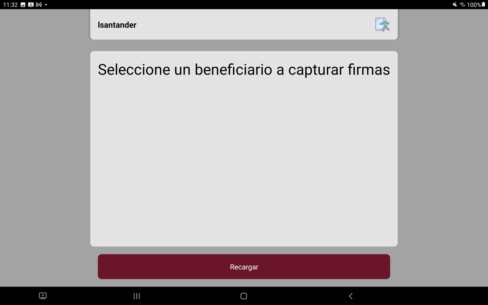
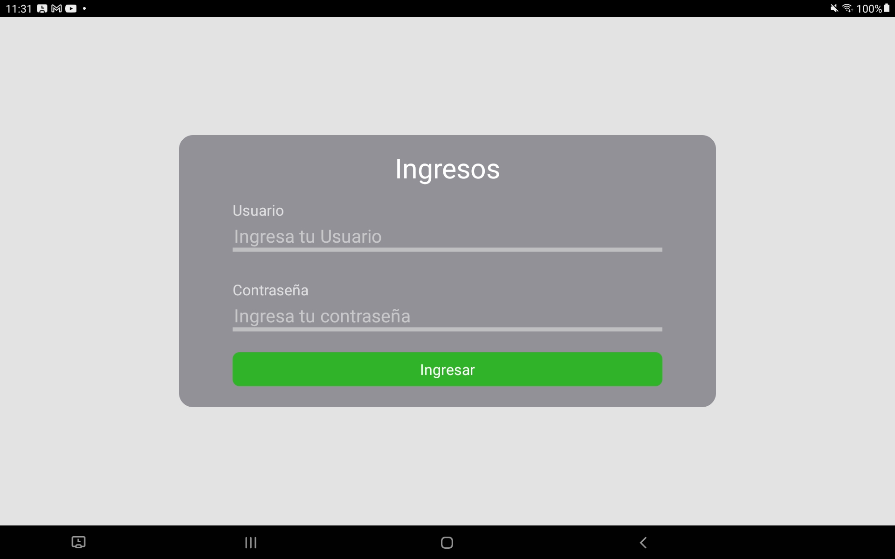

# Vistas de la App
**[README](../README.md)**

Las cuales son tres principalmente

## Vista principal

Solo se muestran los usarios que previamente se soliciten formas por parte de la trabajadora social, se mostrara el nombre, id_del apoyo y el curp del beneficiario, 

## Login 
Solo se solicita el nombre del usuario y su contraseña del sistema, en caso de ser correcto devulve un true, esto hace que pase a la siguiente pantalla("Home")

>**NOTA**
>
